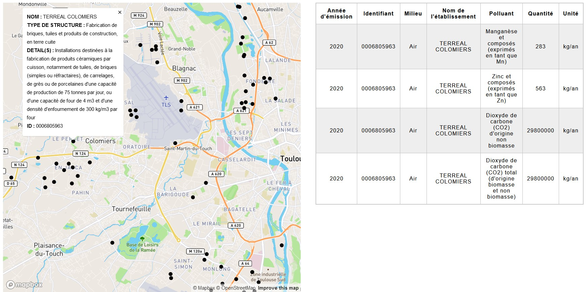

## A try to leverage IRIP open database (Location and details of industries establishments)
### Basics
Behind this pompous name it's just a try to create an app that aims at valuing a open dataset that tell where emitting industries are and what do they emit

#### Installs:

Install necessary librairies using: 

``conda env create -f environment.yml``

### Back-end:
Run the API using ```flask --app app run```

There's two end-points :

```/api/geo_etb```

Serves locations of industrials establishments with few infos available to front code

```/api/ccles_emissions/<string:etb_id>```

Replacing '<string:etb_id>' with an establishment's id allows to get all the emissions data associated to this id

### Front-end:
Using basic .JS and .html I created a web page that shows an interactive MapboxGL map on the left side and a chart on the right showing the details of emmissions
